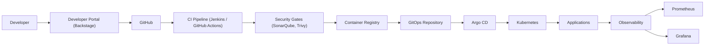

# Hi, I'm Ajay Bongani

**Platform & Cloud Architect | Kubernetes | Terraform | GitOps | SRE | DevSecOps**

Hyderabad, India · [ajdevopssolutions.com](https://ajdevopssolutions.com/) · [LinkedIn](https://www.linkedin.com/in/ajay-bongani/) · [Blog](https://ajdevopssolutions.medium.com/) · [Portfolio](https://ajaybongani.netlify.app/)

---

## About Me

I design and build cloud-native platforms — the infrastructure, delivery pipelines, and operational tooling that let engineering teams ship safely and self-serve. My work spans Kubernetes platform architecture, Terraform-based infrastructure automation, GitOps delivery with ArgoCD, and the security and observability layers that make a platform production-ready rather than just a demo.

The repositories below are reference implementations and portfolio projects — each one is a working system I built to demonstrate a specific piece of platform engineering: self-service developer platforms, GitOps delivery, service-mesh security, and CI/CD pipeline design.

---

## What I Build

**Internal Developer Platforms**
Self-service infrastructure and golden paths — a Backstage-based portal wired to Terraform, ArgoCD, and Prometheus so engineers can scaffold and deploy services without filing a ticket.

**GitOps Delivery**
Git as the single source of truth for Kubernetes state, with ArgoCD reconciling drift, App-of-Apps patterns for multi-environment promotion, and automated rollback via `git revert`.

**Cloud-Native Security**
Service-mesh security with Istio — strict mTLS between services, circuit breaking, and traffic-shifting for canary releases.

**CI/CD Pipeline Design**
Pipelines that gate on code quality and container security before anything reaches a cluster — SonarQube quality gates, Trivy vulnerability scanning, and Kubernetes-native deployment.

---

## Platform Engineering Flow

---

## Technology Stack

**Cloud**
AWS · Azure · GCP

**Containers & Orchestration**
Docker · Kubernetes · EKS · Istio AKS GKE OPENSHIFT

**Infrastructure as Code**
Terraform · Helm · Kustomize

**CI/CD**
GitHub Actions · Azure Devops AWS Devops Gcp Devops Gitlab 

**GitOps**
Argo CD

**Observability**
Prometheus · Grafana NewRelic DataDog ELK 

**Security**
mTLS · RBAC · Secrets Management · Container Scanning (Trivy) · Static Analysis (SonarQube)

**Platform Engineering**
Backstage · Internal Developer Platforms · Golden Paths

---

## Featured Projects

### [Internal Developer Platform](https://github.com/bonganiajay26/platform-engineering-architecture)
A self-service developer platform built on Backstage, with Terraform provisioning EKS/VPC/IAM infrastructure, ArgoCD handling GitOps delivery, and Prometheus/Grafana providing observability — all surfaced through a single portal where engineers scaffold and deploy services.
**Technologies:** Backstage, Terraform, EKS, ArgoCD, Prometheus, Grafana
**Demonstrates:** Platform-as-a-product thinking, self-service infrastructure, IDP architecture

### [Production-Grade GitOps Platform](https://github.com/bonganiajay26/argocd-gitops)
A multi-environment (dev/staging/prod) GitOps pipeline using ArgoCD's App-of-Apps pattern, with Kustomize overlays per environment, RBAC scoped per namespace, and a documented operations/troubleshooting runbook.
**Technologies:** ArgoCD, Kustomize, Helm, Prometheus, NGINX Ingress
**Demonstrates:** GitOps single-source-of-truth delivery, environment isolation, operational documentation

### [GitOps Deployment Workflow](https://github.com/bonganiajay26/gitops-deployment-workflow)
A CI→CD pipeline where GitHub Actions builds and tests code, then commits the new image tag to a GitOps repo — never applying changes directly to the cluster. ArgoCD detects the drift and reconciles.
**Technologies:** GitHub Actions, ArgoCD, Helm, Kustomize
**Demonstrates:** Push-vs-pull deployment models, drift correction, Git-based rollback

### [Microservices with Istio Service Mesh](https://github.com/bonganiajay26/microservices-k8s-architecture)
A microservices deployment secured end-to-end with Istio: strict mTLS between every service, circuit breaking under load, and weighted traffic-splitting for canary releases — observed through Kiali, Jaeger, and Grafana.
**Technologies:** Istio, Kubernetes, Envoy, Kiali, Jaeger
**Demonstrates:** Zero-trust service-to-service security, resilience patterns, progressive delivery

### [CI/CD Pipeline with Jenkins](https://github.com/bonganiajay26/cicd-pipeline-architecture)
A Jenkins pipeline that gates every build on SonarQube code quality and Trivy vulnerability scanning before pushing to a registry and deploying to Kubernetes.
**Technologies:** Jenkins, SonarQube, Trivy, Kubernetes, Docker
**Demonstrates:** Security-gated delivery, quality enforcement, pipeline-as-code

### [DevOps + MLOps + AIOps Learning Labs](https://github.com/bonganiajay26/DEVOPSTOOLS-LAB4ALL)
*(Learning Project)* — A structured, hands-on lab collection covering 18 topic areas from Git fundamentals through MLOps and AIOps, each with docs, working examples, and interview-prep material.
**Technologies:** Git, Docker, Kubernetes, Terraform, Ansible, Prometheus
**Demonstrates:** Breadth across the DevOps/platform toolchain, structured technical writing

---

## Let's Connect

I'm always interested in conversations about platform engineering, Kubernetes architecture, and developer experience. Reach me on [LinkedIn](https://www.linkedin.com/in/ajay-bongani/) or check out my writing on [Medium](https://ajdevopssolutions.medium.com/).
