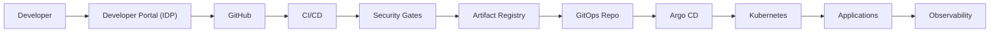

# Ajay Bongani

### Principal Platform Engineer | Platform & Cloud Architect | DevOps | SRE

*Designing secure, scalable and reliable cloud platforms with Kubernetes, Terraform, GitOps, DevSecOps and SRE practices.*

[LinkedIn](https://www.linkedin.com/in/ajay-bongani/) · [Blog](https://ajdevopssolutions.medium.com/) · [Portfolio](https://ajaybongani.netlify.app/) · Hyderabad, India

 

## About

I design and build cloud-native platforms — the infrastructure, delivery pipelines, and operational tooling that let engineering teams ship safely and self-serve. My work spans Kubernetes platform architecture, Terraform-based infrastructure automation, GitOps delivery, and the security and observability layers that turn a working demo into a production-ready system.

 

## What I Build

|  |  |
|---|---|
| **Internal Developer Platforms** | Self-service infrastructure and golden paths, so engineers scaffold and deploy without filing a ticket |
| **Cloud & Kubernetes Platforms** | Secure, scalable clusters with RBAC, network policy, autoscaling, and multi-environment isolation |
| **GitOps Delivery** | Git as the single source of truth, with automated reconciliation and drift correction |
| **CI/CD Pipelines** | Quality- and security-gated delivery — nothing reaches a cluster unscanned |
| **Zero-Trust Service Security** | Service-mesh mTLS, circuit breaking, and progressive delivery patterns |

 

## Platform Engineering Architecture

 

## Engineering Capabilities

**Cloud** — Azure · AWS · Google Cloud

**Containers & Kubernetes** — Docker · Kubernetes · EKS · Istio · Helm

**Infrastructure as Code** — Terraform

**CI/CD** — GitHub Actions · Jenkins

**GitOps** — Argo CD · Kustomize

**SRE & Observability** — Prometheus · Grafana

**DevSecOps** — RBAC · mTLS · Secrets Management · Container Scanning (Trivy) · Static Analysis (SonarQube)

**Platform Engineering** — Backstage · Internal Developer Platforms · Golden Paths

 

## Cloud Platform Equivalents

| Capability | Azure | AWS | Google Cloud |
|---|---|---|---|
| Kubernetes | AKS | EKS ✅ *used in flagship IDP* | GKE |
| Secrets | Key Vault | Secrets Manager | Secret Manager |
| Identity | Managed Identity | IAM Roles ✅ *used* | Workload Identity |
| Monitoring | Azure Monitor | CloudWatch | Cloud Monitoring |

*Hands-on implementation to date is AWS-based (EKS/IAM); Azure/GCP equivalents shown for context, not claimed as built.*

 

## Featured Platform Projects

### Internal Developer Platform
**Backstage · Terraform · Argo CD · Prometheus**

A self-service developer platform: Terraform provisions EKS/VPC/IAM, Argo CD handles GitOps delivery, and engineers scaffold + deploy services through a single portal.

[Source](https://github.com/bonganiajay26/platform-engineering-architecture)

---

### Production-Grade GitOps Platform
**Argo CD · Kustomize · Helm · Prometheus**

Multi-environment (dev/staging/prod) GitOps delivery using the App-of-Apps pattern, with per-namespace RBAC and full operations/troubleshooting documentation.

[Source](https://github.com/bonganiajay26/argocd-gitops)

---

### GitOps Deployment Workflow
**GitHub Actions · Argo CD · Helm · Kustomize**

CI builds and tests; CI never touches the cluster. Image tags are committed to a GitOps repo, and Argo CD reconciles the drift — push-based CI, pull-based CD.

[Source](https://github.com/bonganiajay26/gitops-deployment-workflow)

---

### Microservices with Istio Service Mesh
**Istio · Kubernetes · Envoy · Kiali**

Zero-trust microservices: strict mTLS between every service, circuit breaking under load, and weighted canary traffic-splitting.

[Source](https://github.com/bonganiajay26/microservices-k8s-architecture)

---

### CI/CD Pipeline with Jenkins
**Jenkins · SonarQube · Trivy · Kubernetes**

Every build is gated on code-quality analysis and container vulnerability scanning before it reaches a registry or a cluster.

[Source](https://github.com/bonganiajay26/cicd-pipeline-architecture)

---

### DevOps + MLOps + AIOps Learning Labs
*Status: Learning Project*

An 18-topic structured lab collection spanning Git through MLOps/AIOps — breadth alongside the depth shown above.

[Source](https://github.com/bonganiajay26/DEVOPSTOOLS-LAB4ALL)

 

## Engineering Principles

`Platform as a Product` `Infrastructure as Code` `GitOps` `Secure by Default` `Developer Self-Service` `Observable Systems` `Automation First` `Everything in Version Control`

 

## Architecture Decision Focus

I evaluate platform designs across: scalability, availability, security, developer experience, operational complexity, cost, disaster recovery, maintainability, and automation potential — documented as ADRs within each flagship repository.

 

## Current Focus

Deepening the platform portfolio with dedicated Terraform-module and SRE/observability reference architectures, and evaluating whether an AI-platform reference implementation (RAG, LLMOps) is worth building next.

 

## Connect

[LinkedIn](https://www.linkedin.com/in/ajay-bongani/) · [Blog](https://ajdevopssolutions.medium.com/) · [Portfolio](https://ajaybongani.netlify.app/)